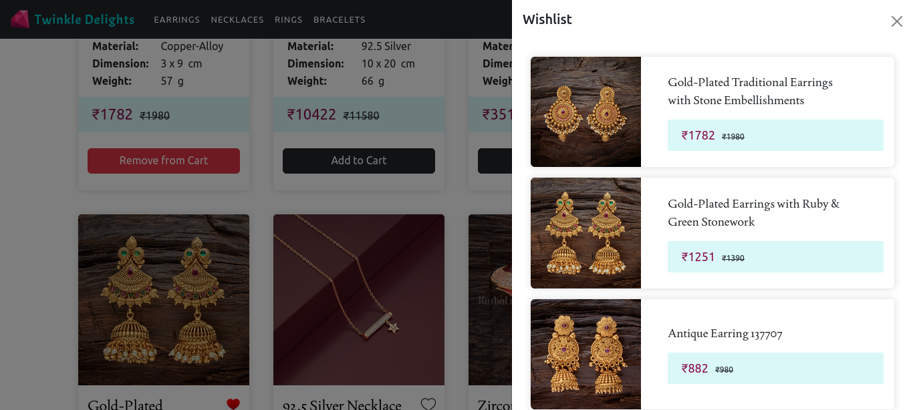

<h1>Twinkle Delights: Jewelery Shopping Website</h1>

<h2>Requirements:</h2>

<h2>Dashboard:</h2>

<h2>Product Details:</h2>

<h2>Products Filtered:</h2>

<h2>Cart:</h2>

<h2>Wishlist:</h2>

<h3>Django REST installations:</h3>
<ul>
    <li>django</li>
    <li>djangorestframework</li>
    <li>django-cors-headers</li>
</ul>